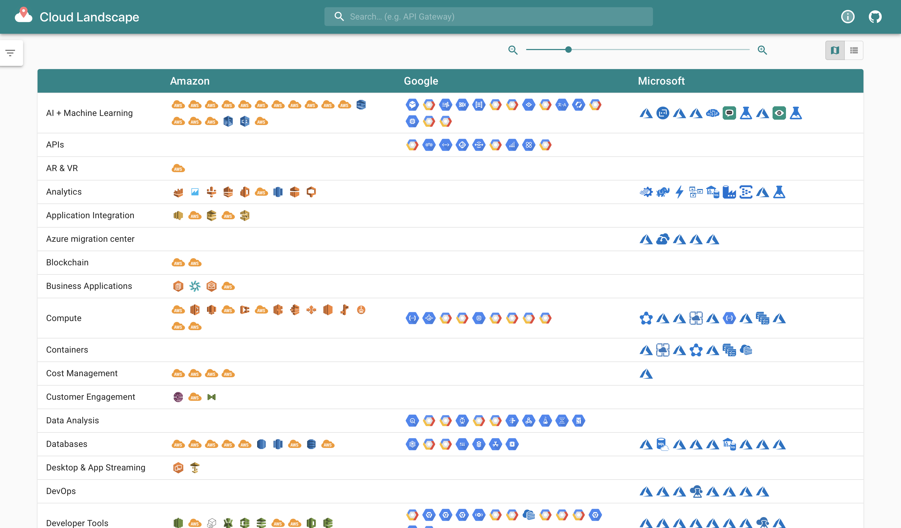
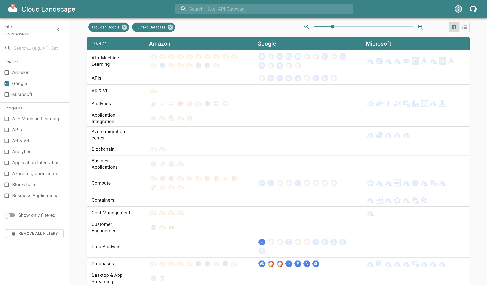
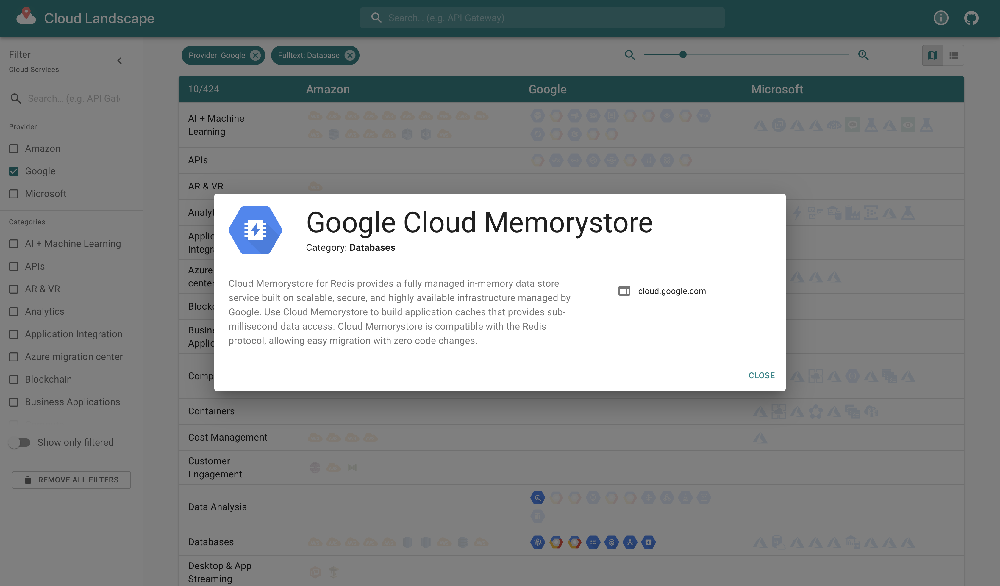
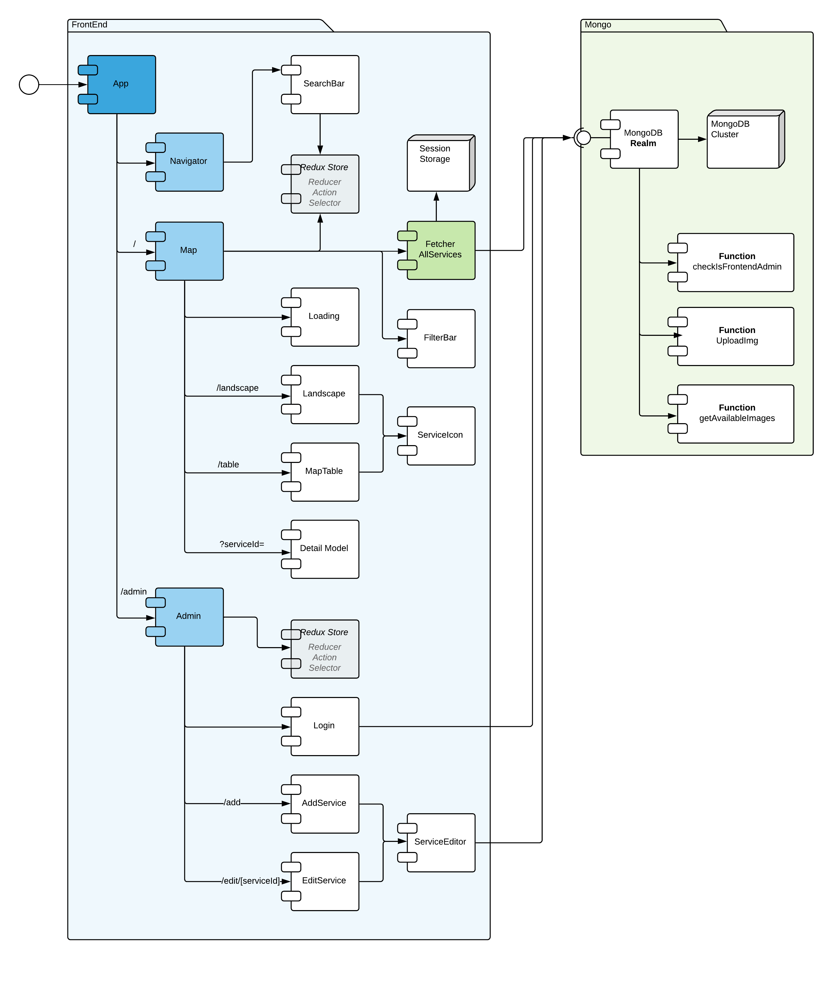

# Cloud Landscape

> Cloud Landscape - [Online demo](http://cloudlandscape.info/landscape/)
>
> Made with ❤️ by the [MaibornWolff ](https://www.maibornwolff.de) DevOps & Cloud Native team.

## Jump to Section

- [What is Cloud Landscape](#What-is-cloud-landscape)
- [Getting started](#Getting-started)
- [Using your own data](#Using-your-own-data)
- [Further dependencies](#Further-dependencies)
- [Used libraries](#Used-libraries)
- [License](#License)

## What is Cloud Landscape

Cloud Landscape is a web-based visualization tool. It was initially designed to visualize the set of cloud services provided by Microsoft (Azure), Amazon (AWS) and Google (GCP). This project includes the respective database for demonstration purposes. Our Cloud Landscape tool also provides a basic search functionality for the items in your database.
Try out the [online demo](http://cloudlandscape.info/landscape/) for cloud services.

## Getting started

### Installation

In order to run the tool with our hosted database provided, you only need to start up the front-end application localy. This can be achieved with the follow steps:

- Download or clone the repo `git clone https://github.com/MaibornWolff/cloud-landscape.git`
- change location `cd cloud-landscape/`
- install dependencies `npm install`
- run dev-server with `npm start`
- access the UI over `localhost:3000/`

### Installation

To build the front-end application for production, follow the steps below:

- build for production with `npm build`
- change location `cd dist/`

### Functionality overview

At the top of the page you will find the search input. The search runs using the logical “AND” so an item has to match all of the entered keywords. In order to zoom the contents of the page use the zoom buttons to the left of the search bar. You can either zoom everything (left toolbox) or only the text (right toolbox). Press the button between the two toolboxes to reset the zoom.

If you click on any of the icons the page will show the detailed view of the selected service.

### Architectur overview
The following Component Diagram pictures the component composition within the react architecture.

## Using your own data

In order to you use your own data source (preferable a non SQL Database), each document in your database must be structured as follows. In the provided example these are the cloud service providers (e.g. Amazon) and the actual cloud service category (e.g. “Storage”). Every entry must match the following JSON format:

    {
        "categoryA": "Name for the first category (y-axis)",
        "categoryAIcon": "./img/CategoryALogo.svg",
        "categoryB": [
            "Name for the second category (x-axis)"
        ],
        "item": "Name of the item",
        "webLink": "https://maibornwolff.de",
        "img": ".\\img\\logos\\ItemLogo.svg",
        "description": "Item description goes here",
        "keywords": [],
        "metadata": [],
        "connections": {
            "in": [],
            "out": []
        }
    }

Or taking an actual example from our database:

    {
        "provider": "Amazon",
        "providerIcon": "./img/logos/AWS/General/AWS_Simple_Icons_AWS_Cloud.svg",
        "category": [
            "Analytics"
        ],
        "service": "Amazon Athena",
        "webLink": "https://aws.amazon.com/athena/?nc2=h_mo",
        "img": ".\\img\\logos\\AWS\\Analytics\\Analytics_AmazonAthena.svg",
        "description": "Amazon Athena is an interactive query service that makes it easy to analyze data in Amazon S3 using standard SQL. Athena is serverless, so there is no infrastructure to manage, and you pay only for the queries that you run.",
        "keywords": [],
        "metadata": [],
        "connections": {
            "in": [],
            "out": []
        }
    }

## Further dependencies

## Used libraries

- React: <https://github.com/facebook/react>
- Redux: <https://github.com/reduxjs/redux>
- MaterialUi: <https://github.com/mui-org/material-ui>
- MongoDB Stich SDK: <https://github.com/mongodb/stitch-js-sdk>
- Axios: <https://github.com/axios/axios>

This project was bootstrapped with [Create React App](https://github.com/facebook/create-react-app).

## License

[Apache-2.0](LICENSE)
